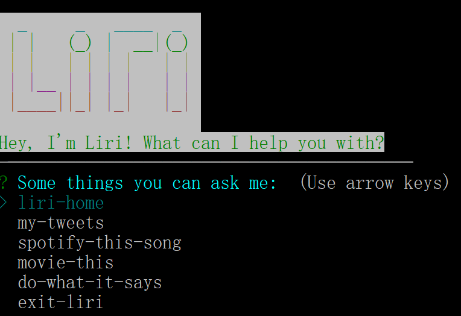
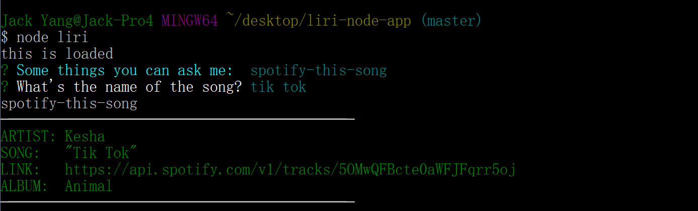
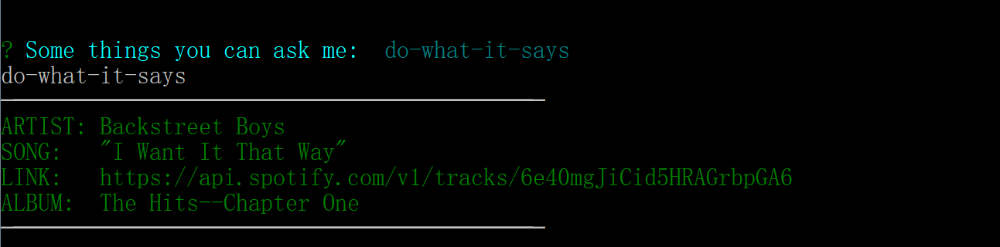

# Introducing Liri Node App

LIRI is like iPhone's SIRI. However, while SIRI is a Speech Interpretation and Recognition Interface, LIRI is a _Language_ Interpretation and Recognition Interface. LIRI will be a command line node app that takes in parameters and gives you back data.

## How to use Liri:

1. Type `npm install` to install all the necessary packages. 
2. Type `node liri`.

##Liri Home

<a href="https://jackjoeng.github.io/liri-node-app">Check it out!</a>

## Required packages
Running `npm install` will install the necessary packages:

- [chalk](https://www.npmjs.com/browse/keyword/chalk) 
- [first-run](https://www.npmjs.com/package/first-run) 
- [inquirer](https://www.npmjs.com/package/inquirer) 
- [node-spotify-api](https://www.npmjs.com/package/node-spotify-api) 
- [twitter](https://www.npmjs.com/package/twitter) 
- [request](https://www.npmjs.com/package/request) 
